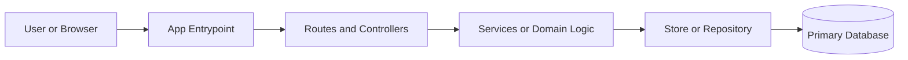
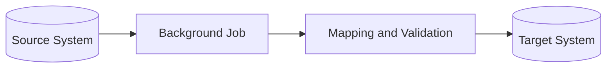

# Mermaid Patterns

Use Mermaid when a diagram will help a developer understand the project faster than prose alone.

## Good fit

- System context
- Request flow
- Background job flow
- Data migration flow
- Package or subsystem relationships

## Avoid

- Reproducing every concrete function call
- Huge node counts
- Diagrams that will drift every time small code changes land

## Conventions

- Prefer short node labels based on subsystems or responsibilities.
- Match names used in the repo: route groups, jobs, services, databases, queues.
- Keep one concern per diagram.
- Put a short explanation under each diagram so readers know what is important.

## Starter patterns

### Runtime architecture

### Background job or importer

### Decision rule

Add a diagram when it saves a new developer from scanning multiple packages to understand the shape of the system.
